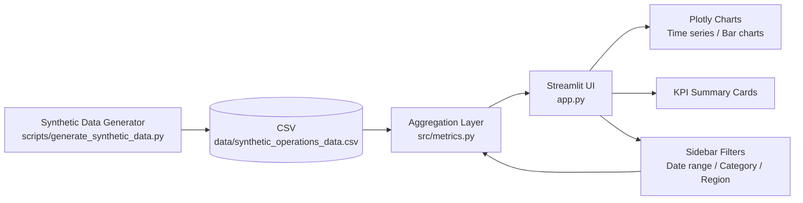
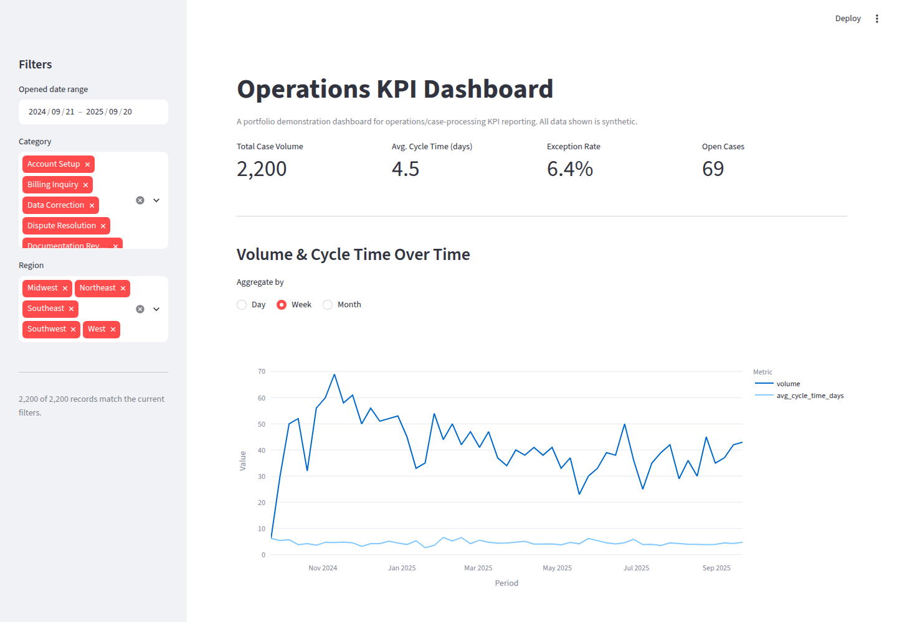

# Operations KPI Dashboard

An interactive dashboard for reporting core operations KPIs — case/transaction
volume, cycle time, and exception rates — to business stakeholders. Built as
a portfolio demonstration of the kind of self-serve analytics tooling a
Senior Business Analyst designs and delivers for operations leadership.

> **Disclaimer:** This is an independently written, representative portfolio
> project built entirely with synthetic data. It does not contain, reproduce,
> or reference any employer's proprietary code, data, or systems.

## Business Use Case

Operations teams that process high volumes of cases, requests, or
transactions (account setup, billing inquiries, service requests, disputes,
renewals, etc.) need a recurring, defensible view of how the operation is
performing so that leadership can spot bottlenecks and staffing issues
early. A Business Analyst supporting such a team is typically asked to
answer questions like:

- **Is intake volume trending up or down, and is it seasonal?**
- **How long does it take, on average, to resolve a case (cycle time), and
  is that improving or degrading?**
- **What fraction of cases are being flagged as exceptions/errors, and
  which categories are driving that?**
- **Are certain regions or categories systematically slower or more
  error-prone than others?**

This project builds a self-serve dashboard that answers those questions
from raw case-level data, with filters so a stakeholder can drill into a
specific time window, category, or region without waiting on an ad hoc
analyst request.

The dataset here uses deliberately generic field names (`case_id`,
`opened_date`, `closed_date`, `category`, `status`, `region`) so the same
pattern applies to insurance claims, banking transaction queues, healthcare
service requests, retail order exceptions, or any other case-based
operation — the point is the analytical pattern, not a specific industry.

## Architecture



The aggregation layer (`src/metrics.py`) is deliberately decoupled from the
Streamlit UI (`app.py`): it takes and returns plain pandas objects, has no
Streamlit imports, and is exercised directly by the unit tests in
`tests/test_metrics.py`. `app.py` is a thin presentation layer on top of it.

## Tech Stack

| Layer            | Technology                          |
|------------------|--------------------------------------|
| UI / dashboard   | [Streamlit](https://streamlit.io/)   |
| Charting         | [Plotly Express](https://plotly.com/python/plotly-express/) |
| Data handling    | pandas, numpy                        |
| Testing          | pytest                               |
| Containerization | Docker                               |
| CI               | GitHub Actions                       |

## Repository Layout

```
ops-kpi-dashboard/
├── app.py                          # Streamlit UI (presentation layer only)
├── src/
│   └── metrics.py                  # Data loading, filtering, KPI aggregation (unit-testable)
├── scripts/
│   └── generate_synthetic_data.py  # Synthetic data generator (seeded, reproducible)
├── data/
│   └── synthetic_operations_data.csv
├── tests/
│   └── test_metrics.py             # pytest suite for src/metrics.py
├── screenshots/
│   └── dashboard.png               # Real captured screenshot of the running app
├── .github/workflows/ci.yml        # GitHub Actions: install deps + run pytest
├── Dockerfile
├── requirements.txt
├── LICENSE
└── README.md
```

## Installation

```bash
# 1. Clone the repository
git clone <this-repo-url>
cd ops-kpi-dashboard

# 2. Create and activate a virtual environment
python3 -m venv .venv
source .venv/bin/activate   # Windows: .venv\Scripts\activate

# 3. Install dependencies
pip install -r requirements.txt
```

## Generating the Data

A sample dataset is already committed at
`data/synthetic_operations_data.csv`, so the app runs out of the box. To
regenerate it (or produce a different size/seed):

```bash
python scripts/generate_synthetic_data.py --rows 2200 --seed 42
```

The generator produces ~2,200 synthetic case records spanning a 12-month
window, with:

- **Seasonal volume trends** — a Q4 peak (Oct–Dec) and a summer lull, plus
  reduced weekend intake, modeled through day-level sampling weights.
- **Category-driven cycle time and exception-rate baselines** — some
  categories (e.g. "Dispute Resolution") are inherently slower and more
  error-prone than others (e.g. "Data Correction").
- **A small number of realistic outliers** — ~1.5% of cases get an injected
  long-tail delay (e.g. stuck-in-queue escalations), so the cycle-time
  distribution has a believable right skew instead of looking artificially
  clean.

All values are generated with `numpy.random.default_rng(seed=42)`, so the
output is fully reproducible.

## Running the Dashboard

```bash
streamlit run app.py
```

Then open the URL Streamlit prints (typically `http://localhost:8501`).

### Running with Docker

```bash
docker build -t ops-kpi-dashboard .
docker run -p 8501:8501 ops-kpi-dashboard
```

## Running Tests

```bash
pytest -v
```

All aggregation logic in `src/metrics.py` — data loading/validation,
filtering, KPI summary, time-series aggregation, category and region
breakdowns — is covered by unit tests, including edge cases such as empty
filter results and malformed input rows. The Streamlit UI itself is not
unit tested (UI testing frameworks for Streamlit are immature); instead it
is verified by running the app and confirming it renders without errors
(see screenshot below).

## Screenshots



*Live screenshot of the running Streamlit application (captured
programmatically with Playwright against a local `streamlit run` process),
showing the sidebar filters, live-computed KPI summary row, and the
volume/cycle-time time-series chart.*

## Dashboard Features

- **KPI summary row** — total case volume, average cycle time (days), and
  exception rate, all computed live from the currently filtered data (never
  hardcoded).
- **Volume & cycle-time trend** — a dual-line time series, aggregable by
  day, week, or month, so a stakeholder can see whether volume or turnaround
  time is trending in the wrong direction.
- **Exceptions by category** — a bar chart ranking categories by exception
  rate, to focus process-improvement conversations on the biggest driver.
- **Breakdown by region** — case volume, average cycle time, and exception
  rate by region, to spot regional staffing or process gaps.
- **Sidebar filters** — date range, category (multi-select), and region
  (multi-select), all of which re-filter every chart and KPI on the page.
- **Graceful empty-state handling** — an overly narrow filter combination
  shows a clear warning instead of an error or a blank/broken chart.

## Limitations & Future Enhancements

This is a portfolio-scale demonstration, not a production system. Notable
simplifications and natural next steps:

- **Single flat CSV, no database.** A production version would read from a
  data warehouse or operational data store (e.g. via a SQL query layer)
  rather than a static file, and would support incremental/streaming
  refreshes instead of a full reload per session.
- **No authentication or row-level access control.** Anyone who can run the
  app sees all data. A production deployment would sit behind SSO and
  enforce role- or region-based row-level security.
- **No caching/scale tuning for large datasets.** `st.cache_data` is used
  for the initial load, but a multi-million-row production dataset would
  need pre-aggregated marts or a proper OLAP layer rather than filtering a
  full DataFrame in memory on every interaction.
- **No alerting.** A natural extension is threshold-based alerts (e.g.
  "exception rate > 10% for 3 consecutive days") pushed to email/Slack
  rather than requiring someone to open the dashboard.
- **No trend forecasting.** Adding a simple forecast (e.g. exponential
  smoothing) on top of the volume time series would help with staffing
  planning.
- **Single-currency/locale assumptions.** Field values (categories,
  regions) are illustrative English-language labels; a production version
  would need localization.

## Security Considerations

- **No external network calls.** The app reads only a local CSV file and
  renders everything client-side in the browser via Streamlit/Plotly —
  there are no API calls, telemetry beacons, or third-party data
  dependencies in the application logic itself.
- **No secrets or credentials anywhere in this repo.** There is nothing to
  configure or rotate; the app requires no API keys, database passwords, or
  tokens.
- **All data is synthetic.** No real case records, customer data, or PII of
  any kind are used or included.
- **Production considerations (not implemented here, but relevant for a
  real deployment):**
  - Access to real operational data would go through a governed data
    access layer (e.g. a warehouse with row-level security), never a flat
    file checked into source control.
  - Any personally identifiable information (names, account numbers,
    contact details) would need to be masked, tokenized, or excluded
    entirely from an analytics-facing dataset, with access logged and
    reviewed.
  - The dashboard would be deployed behind the organization's SSO/identity
    provider, with role-based access scoping which regions/categories a
    given viewer can see.
  - Secrets (database credentials, API keys) would be injected via a
    secrets manager or environment variables at deploy time — never
    committed to source control — and the `.gitignore` in this repo already
    excludes typical local-secret file patterns as a matter of habit.

## License

Released under the [MIT License](LICENSE).
